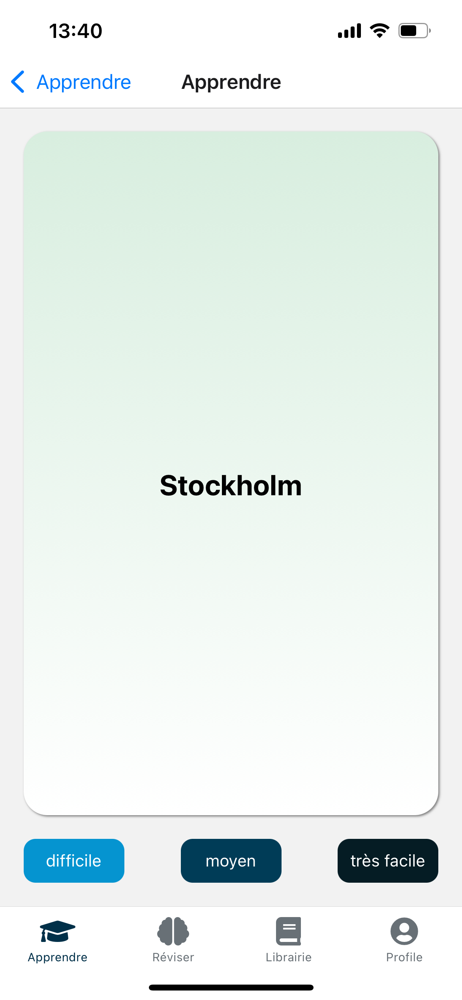

# Application Mobile avec Expo (React Native) : Fast Learning

## Fast Learning est une application mobile qui repose sur le principe de répétition espacée pour mémoriser des informations sur le long terme.

|  |  |  |  |
| -------------------------------- | ----------------------------- | -------------------------------- | ------------------------------- |

## Les instructions d'intallation du projet

-   cloner le projet
-   ajouter le .env
-   Installer les dépendances : npm install
-   lancer la commande expo : npm expo start
-   installer expo go sur le téléphone et scanner le qr code

## Les commandes utiles pour travailler
-   
-   
-   expo lint (pour lancer les linters)
-   npx prettier --write . (pour cleaner le code)

## Un bug trouvé

Si tu trouves un bug dans le code ou dans l'installation de cette application, s'il te plait, contacte moi par mail à cette adresse : guiffaultelian@gmail.com.
